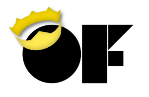
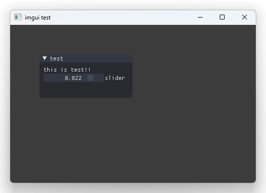
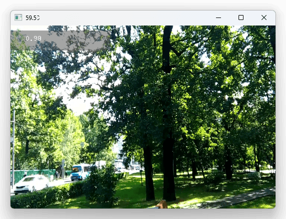

# of-nim



nim openFrameworks integration

openFrameworks v0.12.0, nim 2.2.8

```nim
import ofApp
import std/strformat
import nimline

{.emit: """
#include "ofMain.h"
""" .}

proc red {.importcpp: "ofColor::red" .}

proc update() {.cdecl.} =
    let r: float = global.ofGetFrameRate()
    let s = fmt"{r:.2f}"
    discard global.ofSetWindowTitle(s)

proc draw() {.cdecl.} =
    discard global.ofSetColor(red)
    discard global.ofDrawRectangle(
        global.ofGetMouseX() - 50,
        global.ofGetMouseY() - 50,
        100, 100)

when isMainModule:
    var app = makeOfApp(update=update, draw=draw)
    app.run(800, 600)
```


## Pre-requisites

### Windows

```bash
$ .¥scripts¥init_win.ps1
```

### Mac

```bash
$ ./scripts/init_mac.sh
```

## Examples

(You may need `nimble install nimline` and `nimble install cppstl` for C++ integration.)

```bash
$ nim c -r examples/hello.nim
$ nim c -r examples/cpp_interop.nim
```

## How to use ofx addons

- At first, create `xxx.nim.addons` at side of the nim file.
    ```txt
    ofxOsc
    ```
- Copy ofxXXX folder into `addons/ofxXXX` (such as ofxOsc) from openFrameworks directory (or other github repository)
- Then try `nim c -r examples\osc_test.nim`
    - You can debug `addon_config.mk` parse log by  `-d:addonsDebug`, such as `nim c -d:addonsDebug -r examples\osc_test.nim`

### NOTE 1: `import ofx_addons`

When you use ofx addons, you need `import ofx_addons` on nim side. This includes `generated/addon_dependencies.nim` on nim side, in order to compile required C++ files.

See [`examples/osc_test.nim`](examples/osc_test.nim) for detail.

(If you find addon which is not working well, while original openFrameworks version is working, please create an issue or create a PR to fix them.)

### NOTE 2: config.txt

Each `addons/ofxXXX` can have `config.txt`.
This is tiny DSL of feels like partial `config.nims` (but not real nim, just original tiny parser.)

```nim
when defined(windows):
    switch("passL", fmt"{addonRoot}\lib\mylib.lib")
elif defined(macosx):
    switch("passL", "-framework Cocoa")

# this is comment
# and debug
echo fmt"debug: addonRoot = {addonRoot}"
```

## Screenshots

### [imgui_test](examples/imgui_test.nim)

Using [`ofxImGui`](https://github.com/jvcleave/ofxImGui/tree/develop) (develop branch)



### [hap_test](examples/hap_test.nim)

Using [`ofxHapPlayer`](https://github.com/funatsufumiya/ofxHapPlayer/tree/feat/remove_ffmpeg) (NOTE that this is forked version)



(ofxHapPlayer needed customized config for nim version)

```nim
# $ cat addons/ofxHapPlayer/config.txt

when defined(windows):
    switch("cc", "vcc")
    switch("passC", fmt"-I{addonRoot}\libs\snappy\include")
    switch("passL", fmt"{addonRoot}\libs\snappy\lib\vs\x64\Release\snappy.lib")
elif defined(macosx):
    switch("passC", fmt"-I{addonRoot}/libs/snappy/include")
    switch("passL", fmt"{addonRoot}/libs/snappy/lib/osx/libsnappy.dylib")
    switch("passL", fmt"-rpath {addonRoot}/libs")
```

## TODO

- Linux support (etc)
- More addon tests, especially having (dyn) libs inside
