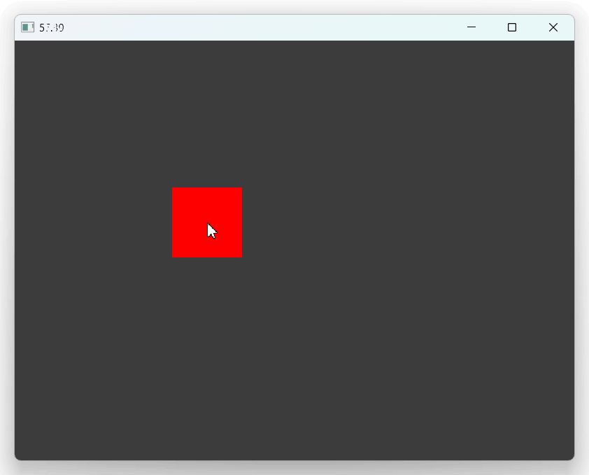

# of-nim

nim openFrameworks integration

openFrameworks v0.12.0, nim 2.2.8

```nim
import ofApp
import std/strformat
import nimline

{.emit: """
#include "ofMain.h"
""" .}

proc red {.importcpp: "ofColor::red" .}

proc update() {.cdecl.} =
    let r: float = global.ofGetFrameRate()
    let s = fmt"{r:.2f}"
    discard global.ofSetWindowTitle(s)

proc draw() {.cdecl.} =
    discard global.ofSetColor(red)
    discard global.ofDrawRectangle(
        global.ofGetMouseX() - 50,
        global.ofGetMouseY() - 50,
        100, 100)

when isMainModule:
    var app = makeOfApp(update=update, draw=draw)
    app.run(800, 600)
```



## Pre-requisites

### Windows

```bash
$ .¥scripts¥init_win.ps1
```

### Mac

```bash
$ ./scripts/init_mac.sh
```

## Examples

```bash
$ nim c -r examples/hello.nim
$ nim c -r examples/cpp_interop.nim
```

## How to use ofx addons

- At first, create `xxx.nim.addons` at side of the nim file.
    ```txt
    ofxOsc
    ```
- Copy ofxXXX folder into `addons/ofxXXX` (such as ofxOsc) from openFrameworks directory (or other github repository)
- Then try `nim c -r examples\osc_test.nim`
    - You can debug `addon_config.mk` parse log by  `-d:addonsDebug`, such as `nim c -d:addonsDebug -r examples\osc_test.nim`

### NOTE: `import ofx_addons`

When you use ofx addons, you need `import ofx_addons` on nim side. This includes `generated/addon_dependencies.nim` on nim side, in order to compile required C++ files.

See [`examples/osc_test.nim`](examples/osc_test.nim) for detail.
